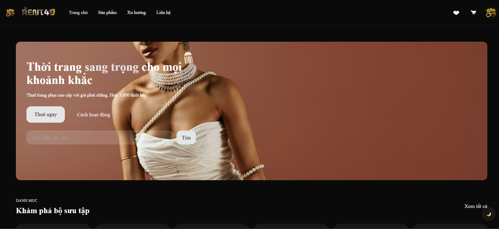
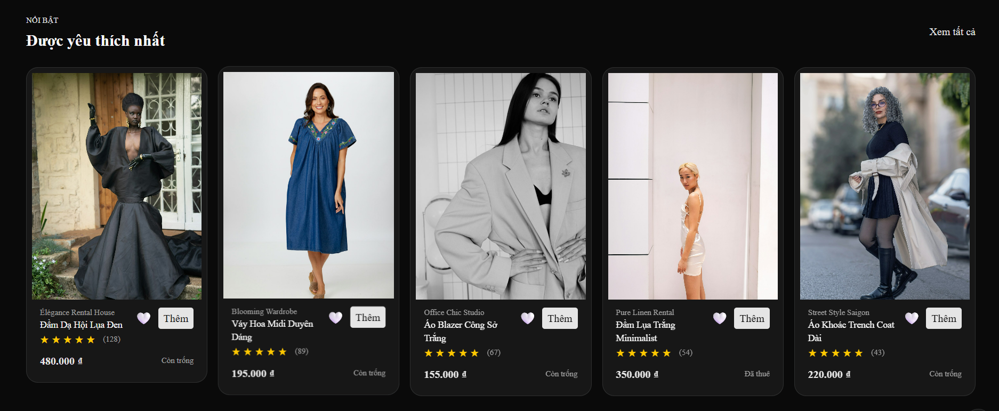

This is a [Next.js](https://nextjs.org) project bootstrapped with [`create-next-app`](https://nextjs.org/docs/app/api-reference/cli/create-next-app).


## Group5 Introduction
| Họ tên             | MSSV     | Vai trò     |
|--------            |------    |---------    |
| Lê Nguyễn Xuân Nhi | 24126163 | Nhóm trưởng | 
| Nguyễn Hương Lan   | 24126110 | Thành viên  |
| Phạm Thị Hoàng Mai | 24126128 | Thành viên  |
| Nguyễn Duy Khanh   | 24126096 | Thành viên  |
| Trần Anh Khải      | 24126097 | Thành viên  |
| Nguyễn Thiên Hào   | 24126054 | Thành viên  |

## About Project
1. Lý do chọn đề tài 
Giới trẻ Việt Nam có nhu cầu cao về chụp ảnh, quay video và thể hiện phong cách cá nhân, nhưng chi phí mua thiết bị và trang phục còn cao, trong khi dịch vụ thuê uy tín chưa phổ biến.

Sàn thương mại Rent4U ra đời nhằm giải quyết:
• Chi phí cao và lãng phí khi mua đồ chỉ dùng ngắn hạn.
• Thiếu nền tảng tích hợp thuê thiết bị sáng tạo và thời trang.
• Nhu cầu tiêu dùng xanh, bền vững của giới trẻ.
• Giúp cho các shop giải quyết được tình trạng tồn kho và quản lý lịch đặt đồ. Đặc biệt mở rộng được các tệp khách hàng.

Mục tiêu:
Trở thành sàn cho thuê sáng tạo hàng đầu cho giới trẻ Việt Nam, thúc đẩy tiêu dùng tuần hoàn và bền vững.
2. Chức năng 
Chức năng dành cho người dùng
• Đăng ký, đăng nhập tài khoản
• Xem và tìm kiếm sản phẩm cho thuê
• Xem chi tiết sản phẩm
• Đặt thuê sản phẩm
• Thanh toán
• Theo dõi và quản lý đơn thuê
• Đánh giá và phản hồi

Chức năng dành cho quản trị viên 
• Quản lý sản phẩm
• Quản lý người dùng
• Quản lý đơn thuê
• Quản lý thanh toán
• Thống kê và báo cáo
• Chức năng hỗ trợ khác

## Link

Figma:
    ** Wireframe: https://rent4u-wireframe.figma.site/
    
    ** Mockup: https://rent4u.figma.site/
Github pages:
    https://lenguyenxuannhi.github.io/nhom5_Rent4U-Thue-quan-ao/

## How to run local

**Yêu cầu (Prerequisites)**
- Node: Node 20.9
- npm (project contains `package-lock.json` — `npm` is the recommended package manager)
- nvm (optional, để dễ chuyển phiên bản Node)

**Phiên bản chính trong dự án**
- `next`: 16.2.4

**Cài đặt**
1. Cài Node (khuyên dùng `nvm`):

	- macOS / Linux:

	```bash
	nvm install 20.9
	nvm use 20.9
	```

	- Windows (nvm-windows) hoặc tải từ Node.js installer: cài Node 20.9

2. Cài dependency:

```bash
npm install
# hoặc (nếu bạn dùng pnpm/yarn)
# pnpm install
# yarn
```

3. Chạy development server:

```bash
npm run dev
```

4. Build & start production:

```bash
npm run build
npm run start
```


## Image


